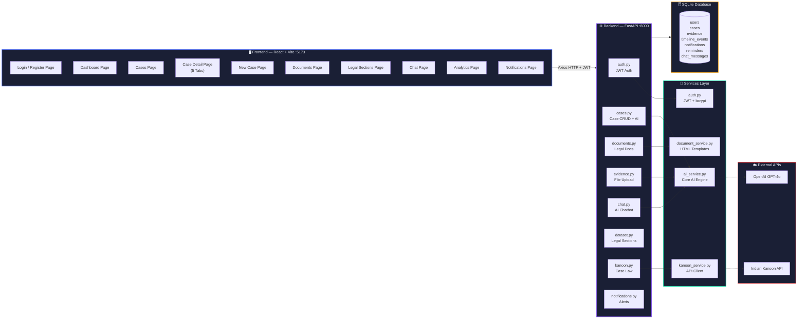
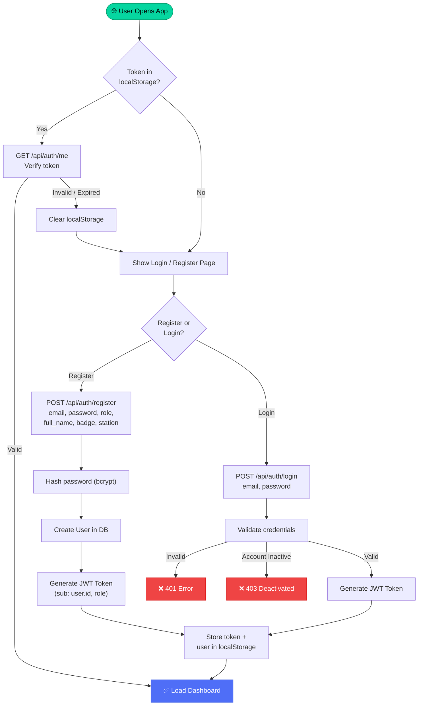
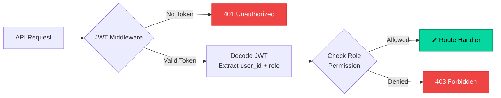
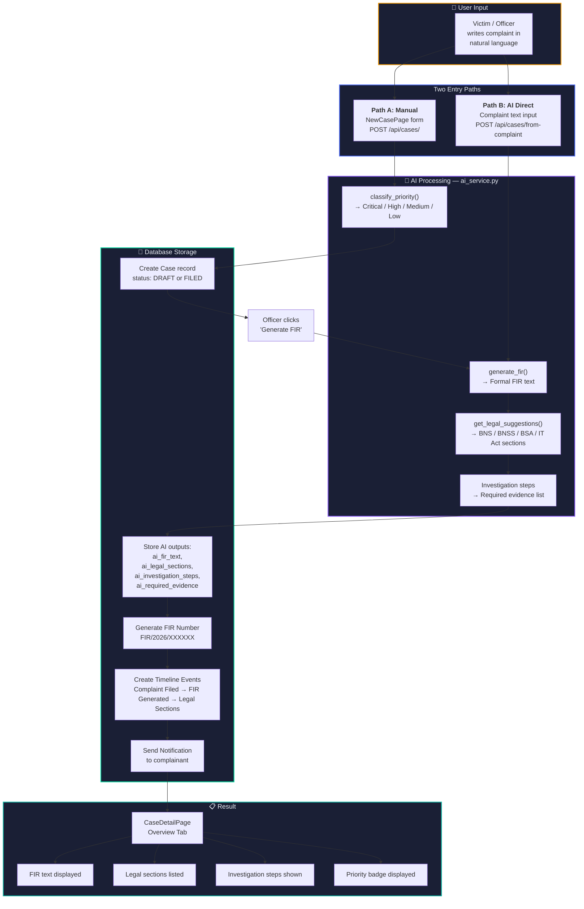
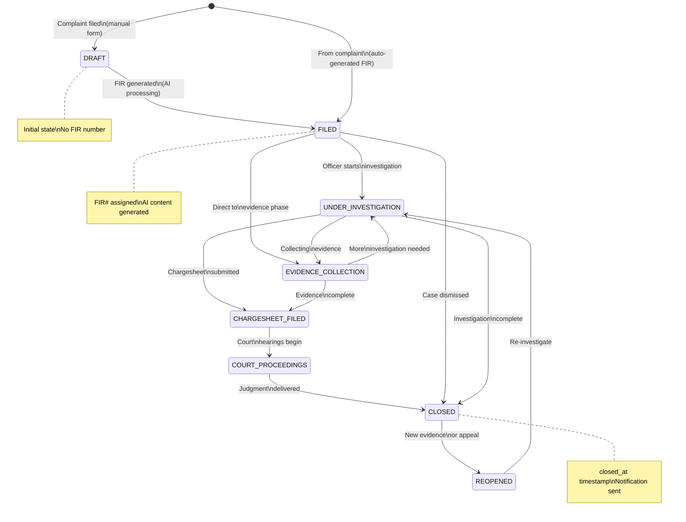
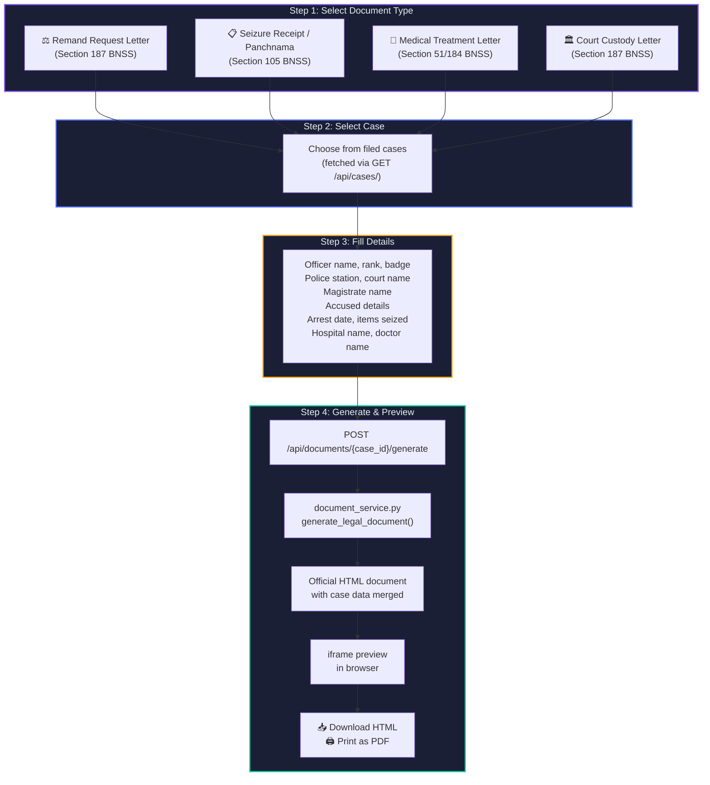
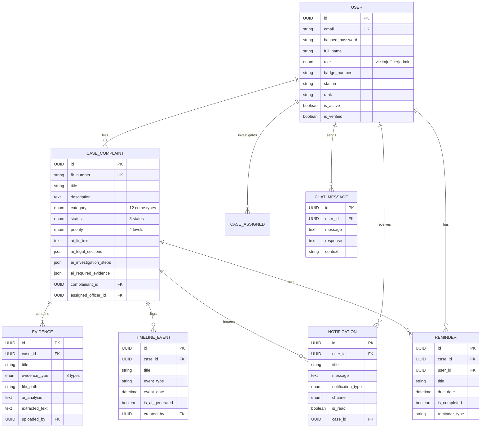
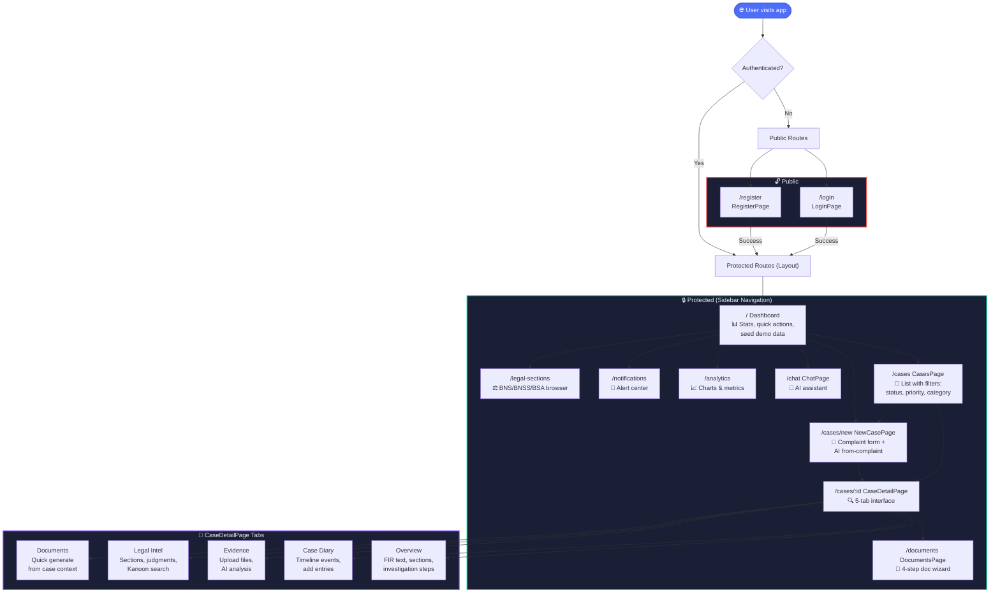

# CrimeGPT — Complete System Workflow Flowcharts (Mermaid.js)

This document contains the complete set of workflow flowcharts for the **CrimeGPT** AI-Powered Crime Documentation & Legal Intelligence Platform, written in standard **Mermaid.js** syntax. 

You can render these diagrams in any Markdown viewer that supports Mermaid (like GitHub, VS Code Markdown Preview, Obsidian, etc.) or paste them directly into the [Mermaid Live Editor](https://mermaid.live).

---

## 📋 Table of Contents
1. [System Architecture](#1-system-architecture)
2. [Authentication & Authorization Flow](#2-authentication--authorization-flow)
3. [AI-Powered FIR Generation Workflow](#3-ai-powered-fir-generation-workflow)
4. [Case Lifecycle & Status Transitions](#4-case-lifecycle--status-transitions)
5. [Legal Document Generation (4-Step Wizard)](#5-legal-document-generation-4-step-wizard)
6. [AI Engine & Service Layer](#6-ai-engine--service-layer)
7. [Database Entity Relationship Diagram](#7-database-entity-relationship-diagram)
8. [Frontend Navigation & User Journey](#8-frontend-navigation--user-journey)

---

## 1. System Architecture
This diagram outlines the complete technology stack and data flow between the client application, API layer, services, databases, and external APIs.



---

## 2. Authentication & Authorization Flow
Details the workflow of checking credentials/tokens, user registration and login, JWT validation, and the permissions granted to each Role-Based Access Control (RBAC) role.



### Route Guard Validation Flow


---

## 3. AI-Powered FIR Generation Workflow
Visualizes the two entry points (Manual Case Registration and AI Direct Complaint Submission) and the processing pipeline that extracts sections, sets priority, generates formal FIR text, and writes to database tables.



---

## 4. Case Lifecycle & Status Transitions
Shows the state machine for the 8 case statuses (`DRAFT`, `FILED`, `UNDER_INVESTIGATION`, `EVIDENCE_COLLECTION`, `CHARGESHEET_FILED`, `COURT_PROCEEDINGS`, `CLOSED`, `REOPENED`).



---

## 5. Legal Document Generation (4-Step Wizard)
Steps to select a legal document template (Remand Request, Seizure Panchnama, Medical Treatment Letter, or Court Custody Letter), merge case metadata, and export/preview the final document.



---

## 6. AI Engine & Service Layer
Depicts the core functions implemented in `ai_service.py` and how the application switches between Live OpenAI Mode and Local Mock Mode based on API Key configuration.

```mermaid
flowchart TD
    subgraph TRIGGER["🔌 Trigger Points"]
        T1["Create Case"]
        T2["Generate FIR"]
        T3["Classify Crime (NLP)"]
        T4["Legal Suggestions"]
        T5["Landmark Judgments"]
        T6["Evidence Upload"]
        T7["Chat Message"]
        T8["Victim Guidance"]
    end

    subgraph ENGINE["🧠 ai_service.py — Core Engine"]
        F1["generate_fir()"]
        F2["classify_priority()"]
        F3["classify_crime_nlp()"]
        F4["get_legal_suggestions()"]
        F5["get_landmark_judgments()"]
        F6["analyze_evidence()"]
        F7["chat_response()"]
        F8["get_multilingual_guidance()"]
    end

    subgraph MODE{"🔀 Operating Mode"}
        M1["🟢 OpenAI Mode<br/>(OPENAI_API_KEY set)<br/>GPT-4o live processing"]
        M2["🟡 Mock Mode<br/>(No API key)<br/>Rule-based + templates"]
    end

    subgraph OUTPUT["📊 AI Outputs"]
        O1["FIR Text (formal format)"]
        O2["Legal Sections (BNS/BNSS/BSA/IT Act)"]
        O3["Priority Level + Reasoning"]
        O4["Investigation Steps"]
        O5["Required Evidence List"]
        O6["Crime Category Scores"]
        O7["Landmark Judgments (SC/HC)"]
        O8["Evidence Analysis Text"]
        O9["Chat Responses (multilingual)"]
    end

    T1 --> F2
    T2 --> F1
    T3 --> F3
    T4 --> F4
    T5 --> F5
    T6 --> F6
    T7 --> F7
    T8 --> F8

    F1 & F2 & F3 & F4 & F5 & F6 & F7 & F8 --> MODE
    M1 --> OUTPUT
    M2 --> OUTPUT

    style TRIGGER fill:#1a1f35,stroke:#f59e0b,stroke-width:2px,color:#e8ecf4
    style ENGINE fill:#1a1f35,stroke:#14b8a6,stroke-width:2px,color:#e8ecf4
    style OUTPUT fill:#1a1f35,stroke:#4f6ef7,stroke-width:2px,color:#e8ecf4
```

---

## 7. Database Entity Relationship Diagram
Diagram of the 7 relational tables in the SQLite database (`users`, `cases`, `evidence`, `timeline_events`, `notifications`, `reminders`, `chat_messages`) with columns, keys, and cardinality.



---

## 8. Frontend Navigation & User Journey
Navigation tree showing public routes, authentication checks, sidebar-accessible pages, and the 5-tab breakdown of the Case Details dashboard.


